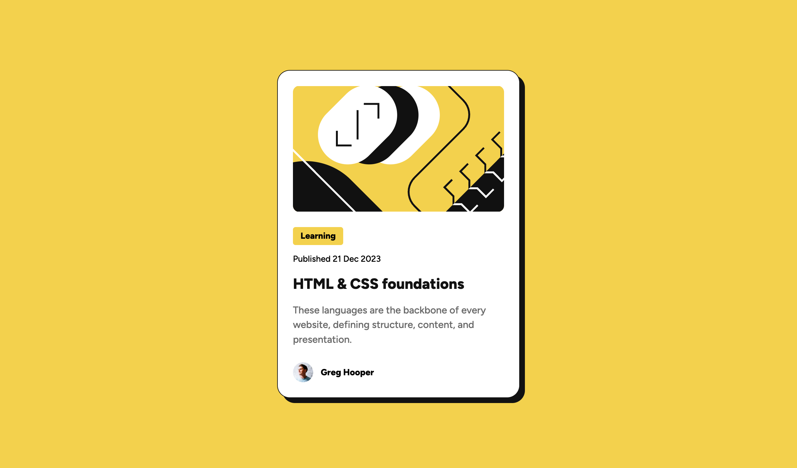

# Frontend Mentor - Blog preview card solution

This is a solution to the [Blog preview card challenge on Frontend Mentor](https://www.frontendmentor.io/challenges/blog-preview-card-ckPaj01IcS). Frontend Mentor challenges help you improve your coding skills by building realistic projects.

## Table of contents

- [Overview](#overview)
  - [The challenge](#the-challenge)
  - [Screenshot](#screenshot)
  - [Links](#links)
- [My process](#my-process)
  - [Built with](#built-with)
  - [What I learned](#what-i-learned)
  - [Useful resources](#useful-resources)
- [Author](#author)

## Overview

### The challenge

Users should be able to:

- See hover and focus states for all interactive elements on the page

### Screenshot

### Links

- Solution URL: [https://github.com/vldslw/blog-preview-card](https://github.com/vldslw/blog-preview-card)
- Live Site URL: [https://vldslw.github.io/blog-preview-card/](https://vldslw.github.io/blog-preview-card/)

## My process

### Built with

- Semantic HTML markup
- Fluid responsive design
- CSS custom properties
- Flexbox
- BEM methodology

### What I learned

In this project, I focused on creating a flexible component that works on any screen size without relying heavily on media queries.

Key takeaways:

1.  **Fluid typography:** I used `clamp()` to ensure font sizes scale smoothly between mobile and desktop viewports. This reduces the need for breakpoints.
2.  **Fluid layout:** Instead of hardcoded breakpoints, I used a combination of `max-width` on the card and `padding` on the container. This allows the card to shrink on smaller screens while maintaining its design integrity.
3.  **Accessibility:** I implemented custom `:focus-visible` states to ensure the component is navigable via keyboard.

### Useful resources

- [Utopia Type Calculator](https://utopia.fyi/type/calculator/) - This tool helped me generate the fluid typography scales. It's a great resource for creating responsive type systems without manual calculations.
- [MDN Web Docs - clamp()](https://developer.mozilla.org/en-US/docs/Web/CSS/clamp) - This article helped me understand the underlying logic of the `clamp()` function.

## Author

- GitHub - [@vldslw](https://github.com/vldslw)
- Frontend Mentor - [@vldslw](https://www.frontendmentor.io/profile/vldslw)
